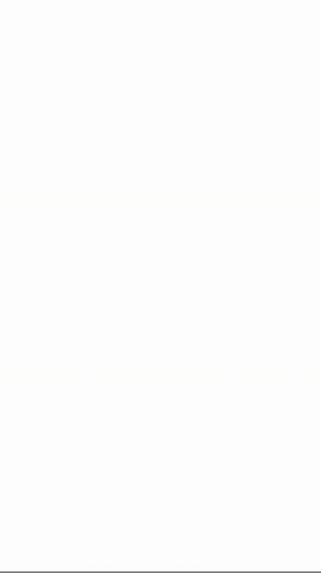
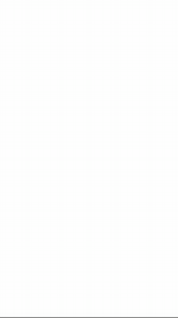

# wvkit

[English](README.md)

[](https://www.npmjs.com/package/@guksu/wvkit-core)
[](https://www.npmjs.com/package/@guksu/wvkit-react)
[](https://www.npmjs.com/package/@guksu/wvkit-vue)
[](LICENSE)
[](https://www.typescriptlang.org/)
[](https://guksu.github.io/wvkit/)

> WebView에 최적화된 헤드리스 UI 프리미티브 — 일반 UI 라이브러리가 무시하는 레이아웃·스크롤·인풋 문제를 해결합니다.

<table>
  <tr>
    <td align="center"><b>ScrollContainer</b><br/>축 제약 pan · 스냅 · 핀치 줌</td>
    <td align="center"><b>PullToRefresh</b><br/>헤드리스 상태 머신 · 저항</td>
    <td align="center"><b>StableInput</b><br/>듀얼 인풋 · IME 안전 · 레이아웃 튐 없음</td>
  </tr>
  <tr>
    <td></td>
    <td></td>
    <td></td>
  </tr>
</table>

<sub>[라이브 데모](https://guksu.github.io/wvkit/)를 실제 터치 제스처 시퀀스로 구동하며 캡처 (브라우저 에뮬레이션).</sub>

---

## 라이브 데모

- **React 데모** — <https://guksu.github.io/wvkit/>
- **Vue 데모** — <https://guksu.github.io/wvkit/vue/>

### 온라인에서 바로 실행 (제로 설치)

npm 배포 패키지를 사용하는 최소 샌드박스 — `PullToRefresh` + `StableInput`:

| 프레임워크 | StackBlitz | CodeSandbox |
|-----------|------------|-------------|
| React | [StackBlitz에서 열기](https://stackblitz.com/github/Guksu/wvkit/tree/main/examples/sandboxes/react) | [CodeSandbox에서 열기](https://codesandbox.io/p/sandbox/github/Guksu/wvkit/tree/main/examples/sandboxes/react) |
| Vue | [StackBlitz에서 열기](https://stackblitz.com/github/Guksu/wvkit/tree/main/examples/sandboxes/vue) | [CodeSandbox에서 열기](https://codesandbox.io/p/sandbox/github/Guksu/wvkit/tree/main/examples/sandboxes/vue) |

---

## 왜 wvkit인가?

네이티브 셸 안에서 동작하는 WebView 앱은 브라우저 우선 라이브러리가 절대 다루지 않는 UI 버그를 만납니다.

- **iOS 키보드가 전체 레이아웃을 튀어 올림** — 포커스 시 `visualViewport` 리사이즈와 스크롤이 동시에 발생
- **독립 세로 스크롤을 가진 가로 페이저** — `overflow-x/y` CSS만으로는 축 고정·스냅·핀치 줌 합성이 불가능
- **당김 새로고침이 네이티브 탄성 바운스와 충돌** — WebView의 기본 오버스크롤 동작은 CSS로 커스터마이즈 불가
- **Safe Area 인셋이 회전 시 변경** — `env(safe-area-inset-*)` 값이 JavaScript에 반응형으로 노출되지 않음
- **소프트 키보드 열림/닫힘에 신뢰할 수 있는 크로스플랫폼 이벤트가 없음** — iOS와 Android 각각 다른 휴리스틱 필요

wvkit은 이 모든 문제를 처리합니다. 각 컴포넌트는 **동작(behavior)만** 노출하고 기본 스타일은 일절 포함하지 않아, 여러분의 팀이 자체 디자인 시스템을 자유롭게 얹을 수 있습니다.

---

## 기능

| 컴포넌트 | 패키지 | 설명 |
|----------|--------|------|
| `ScrollContainer` | core / react / vue | 핀치 줌을 지원하는 가로/세로 뷰포트 페이저. Three.js CSS3DRenderer + OrthographicCamera 기반으로 축 고정 pan, 스냅, 엣지 저항, 패널 가상화를 제공합니다. |
| `StableInput` | core / react / vue | iOS 키보드 레이아웃 이동 방지 인풋. 듀얼 인풋 구조(디스플레이 + 숨김 fixed)에 `visualViewport` 리스너를 조합해 레이아웃 점프를 억제합니다. |
| `PullToRefresh` | core / react / vue | 헤드리스 당김 새로고침 상태 머신 (`idle → pulling → armed → refreshing → resetting`). 저항 곡선·비동기 새로고침·`overscroll-behavior: contain`으로 네이티브 PTR 차단을 내장합니다. |
| `useVirtualKeyboard` | core / react / vue | `visualViewport` 리사이즈 델타로 소프트 키보드 열림/닫힘 상태를 추론합니다. iOS·Android 휴리스틱 내장. |
| `useSafeArea` | core / react / vue | `env(safe-area-inset-*)` CSS 값을 JavaScript로 읽어 반응형으로 제공합니다. 기기 방향 변경 시 자동 갱신. |
| `useScrollLock` | core / react / vue | 레이아웃 이동 없이 `<body>` 스크롤을 막습니다 (`overflow: hidden` + 스크롤 위치 보존). |

---

## 문서

컴포넌트별 심화 문서 — 문제 배경, 아키텍처, 전체 API 레퍼런스, 알려진 제한사항:

| 컴포넌트 | 문서 |
|----------|------|
| `ScrollContainer` | [docs/components/scroll-container/index.md](docs/components/scroll-container/index.md) |
| `StableInput` | [docs/components/stable-input/index.md](docs/components/stable-input/index.md) |
| `PullToRefresh` | [docs/components/pull-to-refresh/index.md](docs/components/pull-to-refresh/index.md) |
| `useVirtualKeyboard` | [docs/components/virtual-keyboard/index.md](docs/components/virtual-keyboard/index.md) |
| `useSafeArea` | [docs/components/safe-area/index.md](docs/components/safe-area/index.md) |
| `useScrollLock` | [docs/components/scroll-lock/index.md](docs/components/scroll-lock/index.md) |

---

## 설치

### Core (Vanilla JS / 프레임워크 무관)

```bash
npm install @guksu/wvkit-core
# ScrollContainer를 사용하는 경우 three가 필요합니다
npm install three
```

### React

```bash
npm install @guksu/wvkit-react @guksu/wvkit-core
npm install three        # ScrollContainer 사용 시 필요
```

### Vue 3

```bash
npm install @guksu/wvkit-vue @guksu/wvkit-core
npm install three        # ScrollContainer 사용 시 필요
```

> `ScrollContainer`를 사용하지 않는다면 `three`는 설치하지 않아도 됩니다.

---

## 빠른 시작

### PullToRefresh

**Core**
```ts
import { createPullToRefresh } from '@guksu/wvkit-core';

const ptr = createPullToRefresh(containerEl, {
  onRefresh: async () => {
    await fetchData();
  },
  threshold: 60,
  resistance: 0.5,
  onStateChange: (state) => console.log(state),
  onPull: (distance, progress) => {
    indicator.style.transform = `translateY(${distance}px)`;
    indicator.style.opacity = String(progress);
  },
});

// 정리
ptr.destroy();
```

**React**
```tsx
import { usePullToRefresh } from '@guksu/wvkit-react';

function Feed() {
  const { containerRef, state, distance, progress, trigger } = usePullToRefresh({
    onRefresh: async () => { await fetchFeed(); },
  });

  return (
    <div ref={containerRef} style={{ height: '100vh', overflowY: 'auto' }}>
      {/* 인디케이터는 직접 렌더링 — progress: 0 → 1 → 초과 */}
      <div style={{ opacity: progress, transform: `translateY(${distance}px)` }}>
        {state === 'refreshing' ? '새로고침 중...' : '당겨서 새로고침'}
      </div>
      <YourContent />
    </div>
  );
}
```

**Vue**
```vue
<script setup lang="ts">
import { usePullToRefresh } from '@guksu/wvkit-vue';

const { containerRef, state, distance, progress } = usePullToRefresh({
  onRefresh: async () => { await fetchFeed(); },
});
</script>

<template>
  <div ref="containerRef">
    <div :style="{ opacity: progress, transform: `translateY(${distance}px)` }">
      {{ state === 'refreshing' ? '새로고침 중...' : '당겨서 새로고침' }}
    </div>
    <YourContent />
  </div>
</template>
```

---

### StableInput

**Core**
```ts
import { createStableInput } from '@guksu/wvkit-core';

const input = createStableInput(containerEl, {
  placeholder: '검색어 입력…',
  onFocus: () => header.classList.add('hidden'),
  onBlur: () => header.classList.remove('hidden'),
  onChange: (value) => search(value),
  onSubmit: (value) => navigate(value),
});

input.focus();
input.setValue('안녕하세요');
input.destroy();
```

**React**
```tsx
import { useStableInput, StableInputDisplay } from '@guksu/wvkit-react';

function SearchBar() {
  const inputProps = useStableInput({
    onChange: (value) => search(value),
    onSubmit: (value) => navigate(value),
  });

  return <StableInputDisplay {...inputProps} className="my-search-input" />;
}
```

**Vue**
```vue
<script setup lang="ts">
import { useStableInput } from '@guksu/wvkit-vue';

const { containerRef, value, isFocused, focus, blur, setValue } = useStableInput({
  onChange: (v) => search(v),
});
</script>
```

---

### ScrollContainer

```ts
import { createScrollContainer } from '@guksu/wvkit-core/scroll-container';

const sc = createScrollContainer(rootEl, {
  direction: 'horizontal',
  panels: panelElements,
  initialIndex: 0,
  enablePinchZoom: true,
  minZoom: 1.0,
  maxZoom: 3.0,
  onIndexChange: (index) => setTab(index),
  onZoomChange: (zoom) => setZoomLabel(zoom),
});

sc.scrollTo(2, { animated: true });
sc.zoomTo(1.5, { animated: true });
sc.destroy();
```

---

### 유틸리티 훅

```ts
// 소프트 키보드 상태
import { createVirtualKeyboard } from '@guksu/wvkit-core';
const kb = createVirtualKeyboard(el, {
  onKeyboardChange: ({ isOpen, keyboardHeight }) => {
    bottomBar.style.transform = isOpen ? `translateY(-${keyboardHeight}px)` : '';
  },
});

// Safe Area 인셋
import { createSafeArea } from '@guksu/wvkit-core';
const sa = createSafeArea(el, {
  onChange: ({ top, bottom }) => {
    header.style.paddingTop = `${top}px`;
    footer.style.paddingBottom = `${bottom}px`;
  },
});

// 스크롤 잠금
import { createScrollLock } from '@guksu/wvkit-core';
const lock = createScrollLock(el, {});
lock.lock();
lock.unlock();
```

---

## API 레퍼런스

> **반응성 주의 (React/Vue 어댑터):** 콜백이 아닌 옵션(`panels`, `direction`, `minZoom` 등)은 마운트 시점에 1회 고정되며, 이후 렌더에서 변경해도 조용히 무시됩니다. 콜백(`onIndexChange`, `onRefresh` 등)은 항상 최신으로 유지됩니다. 새 non-callback 옵션을 적용하려면 재마운트를 강제하세요 — React는 호스트 컴포넌트에 새 `key`를 전달, Vue는 `:key` / `v-if`를 사용합니다. 이 규칙은 `@guksu/wvkit-react` / `@guksu/wvkit-vue`의 모든 어댑터 훅·컴포저블에 공통 적용됩니다.

### PullToRefresh

| 옵션 | 타입 | 기본값 | 설명 |
|------|------|--------|------|
| `onRefresh` | `() => Promise<void> \| void` | — | 새로고침 콜백. Promise 반환 시 resolve까지 `refreshing` 유지. |
| `threshold` | `number` | `60` | 새로고침 트리거 당김 거리(px). |
| `maxDistance` | `number` | `120` | 최대 당김 거리(px). |
| `resistance` | `number` | `0.5` | 저항 계수 (0–1). |
| `enabled` | `boolean` | `true` | 활성화 여부. |
| `disableOverscrollContain` | `boolean` | `false` | `overscroll-behavior: contain` 자동 적용 opt-out. |
| `onStateChange` | `(state) => void` | — | 상태 전이 콜백. |
| `onPull` | `(distance, progress) => void` | — | 당김 거리 업데이트 콜백. |

### StableInput

| 옵션 | 타입 | 기본값 | 설명 |
|------|------|--------|------|
| `type` | `string` | `'text'` | 인풋 타입. |
| `placeholder` | `string` | — | 플레이스홀더 텍스트. |
| `suppressLayoutShift` | `boolean` | `true` | `visualViewport` 리스너 활성화 여부. |
| `scrollAnchor` | `'top' \| 'bottom' \| 'none'` | `'bottom'` | 키보드 등장 시 스크롤 앵커. |
| `onChange` | `(value: string) => void` | — | 값 변경 콜백. |
| `onSubmit` | `(value: string) => void` | — | 제출 콜백 (Enter 키). |

### ScrollContainer

| 옵션 | 타입 | 기본값 | 설명 |
|------|------|--------|------|
| `direction` | `'horizontal' \| 'vertical' \| 'both'` | `'horizontal'` | 카메라 pan 축 제약. |
| `panels` | `HTMLElement[]` | — | 표시할 패널 엘리먼트 배열. |
| `initialIndex` | `number` | `0` | 초기 활성 패널 인덱스. |
| `enablePinchZoom` | `boolean` | `true` | 핀치 줌 활성화. |
| `minZoom` | `number` | `1.0` | 최소 줌 레벨. |
| `maxZoom` | `number` | `3.0` | 최대 줌 레벨. |
| `overscan` | `number` | `1` | 뷰포트 밖에서 마운트 상태를 유지할 패널 수. |
| `snapThreshold` | `number` | `0.3` | 스냅 트리거 스와이프 비율. |
| `resistance` | `number` | `0.2` | 엣지 고무줄 저항값. |
| `onIndexChange` | `(index: number) => void` | — | 활성 패널 변경 콜백. |
| `onZoomChange` | `(zoom: number) => void` | — | 줌 레벨 변경 콜백. |

---

## 브라우저 / WebView 지원

| 환경 | ScrollContainer | StableInput | PullToRefresh | VirtualKeyboard | SafeArea |
|------|:-:|:-:|:-:|:-:|:-:|
| iOS Safari 16+ | ✅ | ✅ | ✅ | ✅ | ✅ |
| WKWebView (iOS 16+) | ✅ | ✅ | ✅ | ✅ | ✅ |
| Android Chrome 90+ | ✅ | ✅ | ✅ | ✅ | ⚠️ |
| Android WebView | ✅ | ✅ | ✅ | ✅ | ⚠️ |
| Samsung Internet | ✅ | ✅ | ✅ | ⚠️ | ⚠️ |
| Desktop Chrome / Firefox | ✅ | ✅ | ✅ | — | — |

> ⚠️ 부분 지원 또는 수동 테스트 필요. SafeArea는 호스트 네이티브 앱이 `viewport-fit=cover`를 설정해야 동작합니다.

---

## 설계 원칙

- **헤드리스** — 동작만, 기본 스타일 없음
- **SSR 안전** — 모듈 로드 시점에 `window`/`document` 접근 없음
- **런타임 의존성 최소화** — `three`는 peer dependency (트리셰이킹 후 호스트가 제공)
- **프레임워크 무관 코어** — React·Vue 어댑터는 동일한 코어 로직을 감싸는 얇은 래퍼
- **destroy 패턴** — 모든 팩토리 함수는 `destroy()` 메서드를 반환하며, 호출 시 모든 이벤트 리스너와 DOM 참조를 정리

---

## 개발

```bash
# 의존성 설치
pnpm install

# 전체 패키지 빌드
pnpm build

# 워치 모드
pnpm dev

# 전체 테스트 실행
pnpm test

# 타입 체크
pnpm typecheck

# 린트 + 포맷
pnpm lint
pnpm format

# 릴리즈 전 changeset 추가
pnpm changeset

# 버전 업 + 배포
pnpm changeset version
pnpm changeset publish
```

전체 기여 가이드(셋업, 테스트, changeset 흐름)는 [CONTRIBUTING.md](CONTRIBUTING.md)를 참고하세요.

---

## 라이선스

MIT © [Guksu](https://github.com/Guksu)
